# Taller Grupal Laboratorio #1 — Contenedores Docker
 
**Curso:** BISOF 18 - Sistemas Operativos II
**Universidad:** Universidad Latina de Costa Rica
**Tema:** Contenedores, Docker, Docker Compose y balanceo de carga con HAProxy
 
---
 
## 👤 Información del estudiante
 
| Campo | Valor |
|---|---|
| Nombre | Esteban Hernandez |
| Fecha | 22/06/26 |
| Sistema operativo | Windows + WSL2 (Ubuntu) |
 
---
 
## 1. Introducción teórica
 
### ¿Qué son los contenedores?
 
Un contenedor es básicamente un proceso en ejecución, aislado del sistema operativo del host mediante características del kernel de Linux como namespaces y cgroups. A diferencia de una máquina virtual, el contenedor no emula un sistema operativo completo: comparte el kernel del host y solo encapsula la aplicación junto con sus dependencias.

 
### ¿Por qué usar contenedores?
 
- **Eficiencia:** usan solo los recursos que necesitan.
- **Portabilidad:** "si corre en mi máquina, corre en cualquier lado".
- **Aislamiento:** cada contenedor tiene su propio sistema de archivos privado.
- **Reproducibilidad:** una misma imagen produce siempre el mismo entorno.
- **Escalabilidad:** facilita replicar servicios para balancear carga.
---
 
## 2. Preparación del entorno (WSL en Windows)
 
Como estoy trabajando en Windows, uso **WSL2** (Windows Subsystem for Linux) con Ubuntu para tener un entorno Linux real donde correr Docker.
 
Después de ejecutar `wsl --install` en PowerShell, abrí Ubuntu desde el menú inicio y creé mi usuario:
 
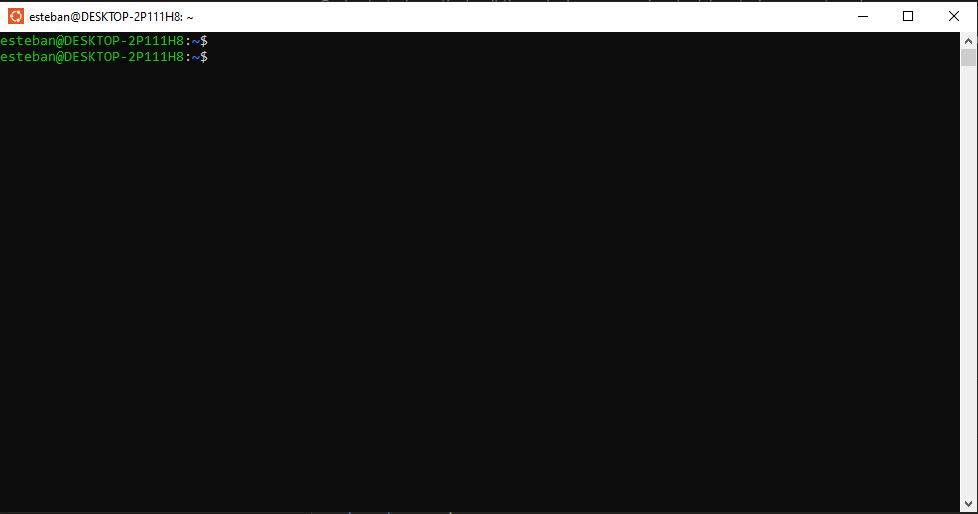
 
Una vez con el prompt `esteban@DESKTOP-2P111H8:~$` listo, ya podía empezar a instalar las herramientas.
 
---
 
## 3. Instalación de Docker en Ubuntu
 
> **Nota técnica:** mi versión de Ubuntu (26.04 "resolute") es muy reciente y el repositorio oficial de Docker (`download.docker.com`) aún no tenía firmas válidas para ella. Por eso usé el paquete `docker.io` de los repositorios oficiales de Ubuntu, que cumple la misma función para este laboratorio.
 
### 3.1 Instalación con apt
 
```bash
sudo apt update
sudo apt install -y docker.io docker-compose-v2
```
 
Esto instala:
- **`docker.io`** → el motor Docker.
- **`docker-compose-v2`** → habilita el comando `docker compose` (con espacio).
### 3.2 Arrancar el servicio
 
En WSL hay que iniciar Docker manualmente porque no usa `systemd`:
 
```bash
sudo service docker start
```
 
### 3.3 Verificación de versiones
 
```bash
docker --version
docker compose version
```
 
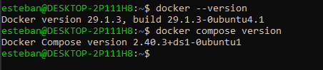
 
### 3.4 Permisos sin `sudo`
 
```bash
sudo usermod -aG docker esteban
newgrp docker
```
 
Luego de aplicar el cambio (con un `wsl --shutdown` desde PowerShell y volver a abrir Ubuntu), confirmé que el grupo `docker` ya estaba activo y probé `hello-world`:
 
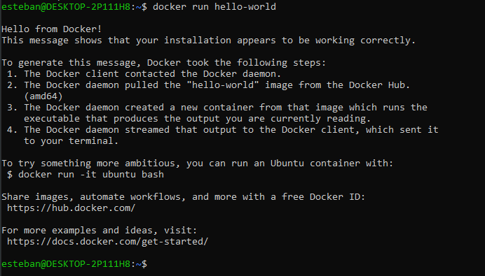
 
Esa salida confirma los 4 pasos del flujo de Docker:
1. El cliente Docker contactó al daemon.
2. El daemon descargó la imagen `hello-world`.
3. El daemon creó un contenedor a partir de esa imagen.
4. El daemon envió la salida al cliente, que la mostró en mi terminal.
---
 
## 4. Estructura del proyecto
 
Después de copiar el `grafana.zip` desde Windows y descomprimirlo en WSL:
 
```bash
cd ~
cp /mnt/c/Users/TU_USUARIO_WINDOWS/Downloads/grafana.zip .
sudo apt install -y unzip
unzip grafana.zip
cd grafana/proyecto
ls -la
```
 
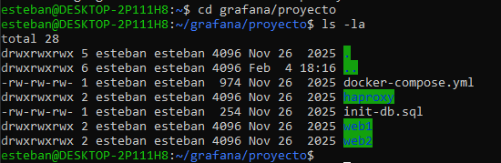
 
La estructura es:
 
```
proyecto/
├── docker-compose.yml      # Orquestador de los 4 contenedores
├── init-db.sql             # Script SQL de inicialización
├── haproxy/
│   └── haproxy.cfg         # Configuración del balanceador
├── web1/
│   ├── Dockerfile          # Imagen Apache+PHP del servidor web 1
│   └── index.php           # Aplicación PHP del web1
└── web2/
    ├── Dockerfile          # Imagen Apache+PHP del servidor web 2
    └── index.php           # Aplicación PHP del web2
```
 
---
 
## 5. Arquitectura del sistema
 
El laboratorio implementa una **arquitectura web con balanceo de carga** compuesta por 4 contenedores conectados a una red Docker privada (`webnet`).
 
```
                        ┌──────────────────┐
                        │     Usuario      │
                        │  (navegador)     │
                        └────────┬─────────┘
                                 │ HTTP :80
                                 ▼
                        ┌──────────────────┐
                        │     HAProxy      │  ← Balanceador de carga
                        │   (puerto 80)    │     (round-robin)
                        └────────┬─────────┘
                                 │
                  ┌──────────────┴──────────────┐
                  │                             │
                  ▼                             ▼
        ┌──────────────────┐         ┌──────────────────┐
        │    web1          │         │     web2         │
        │ (Apache + PHP)   │         │ (Apache + PHP)   │
        └────────┬─────────┘         └────────┬─────────┘
                 │                            │
                 └──────────────┬─────────────┘
                                │
                                ▼
                        ┌──────────────────┐
                        │     MariaDB      │  ← Base de datos
                        │   (puerto 3306)  │
                        └──────────────────┘
 
                    Red Docker privada: webnet
```
 
### Flujo de una petición
 
1. El usuario abre `http://localhost:80` en el navegador.
2. **HAProxy** recibe la petición en el puerto 80.
3. HAProxy decide a cuál backend enviar la petición (`web1` o `web2`) usando el algoritmo **round-robin**.
4. El **Apache** del contenedor seleccionado procesa la petición y ejecuta `index.php`.
5. El **PHP** se conecta a **MariaDB** usando PDO.
6. La respuesta vuelve al usuario.
---
 
## 6. Explicación de cada archivo
 
### 6.1 `docker-compose.yml`
 
Define los 4 servicios, la red privada y cómo se relacionan.
 
**Puntos importantes:**
 
- `image: mariadb:latest` → usa la imagen oficial pre-construida desde Docker Hub.
- `build: ./web1` → en lugar de usar una imagen existente, **construye** la imagen desde el Dockerfile.
- `container_name: mariadb` → el nombre del contenedor también funciona como **hostname DNS** dentro de la red. Por eso `index.php` puede conectarse al host llamado simplemente `mariadb`.
- `ports: "80:80"` → mapea el puerto 80 del host al puerto 80 del contenedor HAProxy. **Solo HAProxy expone puertos al host.**
- `volumes` → bind mount que monta el archivo de configuración desde el host hacia el contenedor.
- `depends_on: [web1, web2]` → garantiza que HAProxy arranque después de los servidores web.
- `networks: webnet` → red tipo `bridge` privada para que los 4 contenedores se vean entre sí.
### 6.2 `web1/Dockerfile` y `web2/Dockerfile`
 
Ambos son idénticos:
 
```dockerfile
FROM php:7.4-apache
RUN docker-php-ext-install pdo pdo_mysql
COPY index.php /var/www/html/
EXPOSE 80
```
 
- **`FROM php:7.4-apache`**: imagen base oficial que ya trae Apache + PHP 7.4 configurados.
- **`docker-php-ext-install pdo pdo_mysql`**: instala las extensiones que PHP necesita para hablar con MariaDB.
- **`COPY index.php /var/www/html/`**: el archivo PHP queda servido como la raíz del sitio.
- **`EXPOSE 80`**: solo es documentación; el puerto **no se publica al host** porque solo HAProxy hace eso.
### 6.3 `index.php`
 
El archivo PHP:
1. Se conecta a MariaDB usando PDO con el hostname `mariadb` (resuelto por la red Docker).
2. Muestra "Conexión exitosa" si la conexión funciona.
3. Hace `SELECT * FROM usuarios` y lista los resultados.
4. Imprime `SERVER_ADDR` (la IP interna del contenedor), lo que permite **ver cuál de los dos web está respondiendo**, demostrando que el balanceo funciona.
### 6.4 `haproxy/haproxy.cfg`
 
```cfg
global
    log 127.0.0.1 local0
    maxconn 200
 
defaults
    log     global
    option  httplog
    timeout connect 5000ms
    timeout client  50000ms
    timeout server  50000ms
 
frontend http_front
    bind *:80
    default_backend http_back
 
backend http_back
    balance roundrobin
    server web1 web1:80 check
    server web2 web2:80 check
```
 
- **`frontend http_front`**: HAProxy escucha en todas las interfaces, puerto 80.
- **`backend http_back`**: hacia dónde envía el tráfico.
- **`balance roundrobin`**: algoritmo de balanceo. Alterna entre web1 y web2 cíclicamente.
- **`server ... check`**: define los backends e incluye health checks periódicos para detectar caídas.
---
 
## 7. Construcción y despliegue
 
```bash
cd ~/grafana/proyecto
docker compose up --build -d
```
 
Qué significa cada parte:
- `up` → crea y levanta los servicios.
- `--build` → fuerza la construcción de imágenes (necesario porque `web1` y `web2` se construyen desde Dockerfile).
- `-d` → modo *detached* (corre en segundo plano).
Docker hace:
1. Descarga `mariadb:latest`, `haproxy:latest` y `php:7.4-apache` desde Docker Hub.
2. Construye las imágenes `proyecto-web1` y `proyecto-web2`.
3. Crea la red `proyecto_webnet`.
4. Levanta los 4 contenedores en orden, respetando `depends_on`.
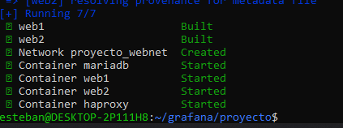
 
### Verificación con `docker ps`
 
```bash
docker ps
```
 
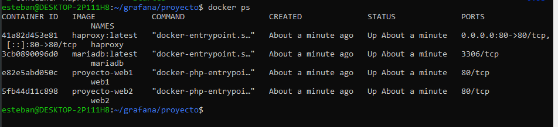
 
Los 4 contenedores aparecen con `STATUS: Up`:
- **haproxy** → mapea `0.0.0.0:80 → 80/tcp` (único expuesto al host).
- **mariadb** → expone `3306/tcp` solo internamente.
- **web1** y **web2** → exponen `80/tcp` solo internamente.
---
 
## 8. Primera prueba (con error de tabla)
 
```bash
curl http://localhost:80
```
 
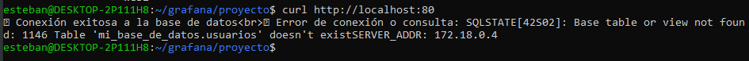
 
Y desde el navegador:
 
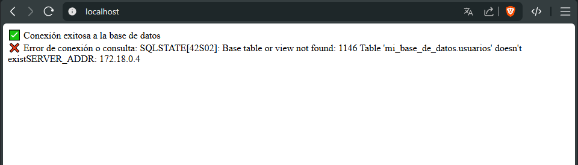
 
**Análisis de esta respuesta:**
 
- ✅ **"Conexión exitosa a la base de datos"** → confirma que PHP se conectó correctamente a MariaDB usando PDO, atravesando la red Docker `webnet` y resolviendo el hostname `mariadb`. Toda la cadena de conectividad funciona.
- ❌ **"Table 'mi_base_de_datos.usuarios' doesn't exist"** → la base de datos existe pero está vacía. Esto ocurre porque en el `docker-compose.yml` original la línea del volumen que monta el script `init-db.sql` estaba **comentada**, por lo que MariaDB nunca ejecutó la creación de la tabla.
- ✅ **`SERVER_ADDR: 172.18.0.4`** → la IP del contenedor que respondió, prueba de que HAProxy enrutó la petición correctamente.
Esto demuestra el correcto funcionamiento de cada capa, pero el `index.php` espera datos. Vamos a arreglarlo.
 
---
 
## 9. Arreglo de la base de datos
 
Hay que hacer tres cosas: **arreglar el script SQL**, **descomentar el volumen** en `docker-compose.yml`, y **recrear MariaDB desde cero** (porque el script de inicialización solo corre la primera vez que el contenedor arranca con la base vacía).
 
### 9.1 Editar `init-db.sql`
 
El archivo original creaba una tabla llamada `mensajes`, pero `index.php` consulta una tabla llamada `usuarios`. Lo reemplacé:
 
```bash
nano init-db.sql
```
 
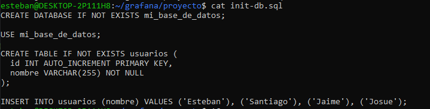
 
El script ahora:
- Crea la base de datos `mi_base_de_datos` si no existe.
- Crea la tabla `usuarios` con columnas `id` (autoincremental) y `nombre`.
- Inserta 4 registros de prueba: Esteban, Santiago, Jaime y Josue.
### 9.2 Descomentar el volumen en `docker-compose.yml`
 
```bash
nano docker-compose.yml
```
 
Las líneas que estaban comentadas:
 
```yaml
#    volumes:
#      - ./init-db.sql:/docker-entrypoint-initdb.d/init-db.sql
```
 
Quedaron así:
 
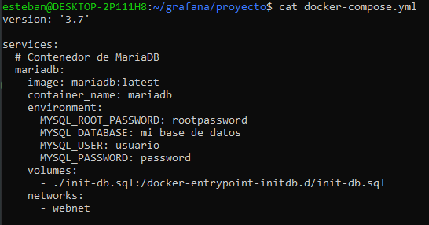
 
El path `/docker-entrypoint-initdb.d/` dentro del contenedor MariaDB es especial: cualquier archivo `.sql` o `.sh` que se monte ahí se ejecuta automáticamente **la primera vez** que la base de datos se inicializa.
 
### 9.3 Recrear todo desde cero
 
Como MariaDB solo corre el script en la **primera** inicialización, hay que borrar su estado y volver a arrancar:
 
```bash
docker compose down -v
docker compose up --build -d
```
 
El `-v` borra los volúmenes anónimos donde MariaDB guarda sus datos.
 
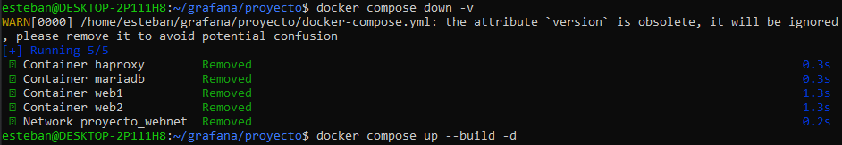
 
### 9.4 Resultado final
 
Al hacer `curl http://localhost:80` (o abrir en el navegador), ahora la respuesta incluye los datos:
 
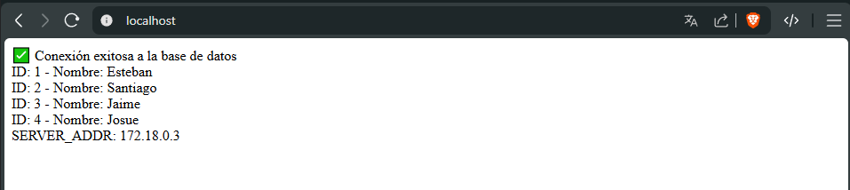
 
Ahora se ven:
- ✅ Conexión exitosa.
- ✅ Los 4 registros listados desde la tabla `usuarios`.
- ✅ `SERVER_ADDR: 172.18.0.3` (la IP del contenedor que atendió).
Esta captura demuestra que **toda la cadena funciona end-to-end**: navegador → HAProxy → Apache/PHP → MariaDB → respuesta con datos.
 
---
 
## 10. Verificación del balanceo de carga
 
Para confirmar que HAProxy alterna entre `web1` y `web2`, hice 6 peticiones consecutivas mirando solo el `SERVER_ADDR`:
 
```bash
for i in 1 2 3 4 5 6; do
  echo "--- Petición $i ---"
  curl -s http://localhost:80 | grep SERVER_ADDR
done
```
 
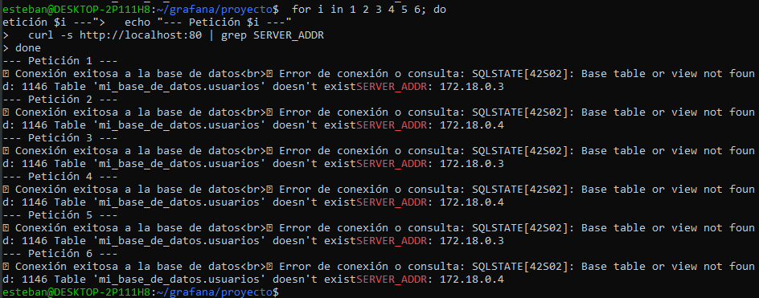
 
El `SERVER_ADDR` alterna perfectamente entre **172.18.0.3** y **172.18.0.4**, confirmando que:
 
- HAProxy está distribuyendo las peticiones con el algoritmo **round-robin**.
- Ambos servidores `web1` y `web2` están sanos y respondiendo (los health checks pasan).
- La carga se reparte 50/50 entre los dos backends.
---
 
## 11. Administración de contenedores Docker
 
### 11.1 Ver logs de un contenedor
 
```bash
docker logs haproxy
```
 

 
En los logs se puede ver:
- La versión de HAProxy (3.4.0).
- El parseo del archivo `haproxy.cfg`.
- Un **WARNING** que indica que `option httplog` está cayendo a `tcplog` porque el frontend no tiene `mode http` explícito. No afecta el funcionamiento del balanceo.
- `Loading success` → la configuración cargó correctamente.
### 11.2 Listar redes Docker
 
```bash
docker network ls
```
 
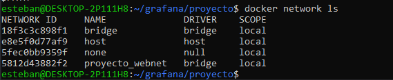
 
Las redes que existen:
- **bridge / host / none** → redes por defecto de Docker.
- **proyecto_webnet** → la red privada que Docker Compose creó para el laboratorio (driver `bridge`). Es la que conecta los 4 contenedores entre sí.
### 11.3 Entrar a un contenedor y ejecutar comandos
 
```bash
docker exec -it web1 bash
```
 
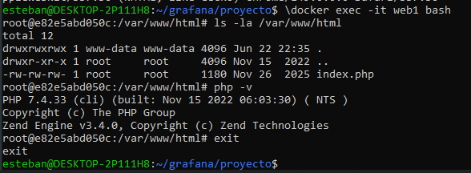
 
Dentro del contenedor verifiqué:
- **`ls -la /var/www/html`** → confirma que `index.php` está copiado al directorio raíz de Apache.
- **`php -v`** → muestra PHP 7.4.33 instalado, con el Zend Engine activo.
- **`exit`** → salir del contenedor (el contenedor sigue corriendo en background).
Este comando es clave para diagnosticar problemas: permite "meterse" al contenedor como si fuera una máquina, sin tener que crear imágenes nuevas.
 
### 11.4 Otros comandos útiles de administración
 
```bash
# Ver puertos publicados
docker port haproxy
 
# Procesos dentro del contenedor
docker top mariadb
 
# Uso de recursos en tiempo real (Ctrl+C para salir)
docker stats
 
# Inspección detallada (JSON)
docker inspect haproxy
 
# Resolución DNS interna entre contenedores
docker exec web1 getent hosts mariadb
docker exec haproxy getent hosts web1
```
 
### 11.5 Ciclo de vida con Docker Compose
 
```bash
docker compose ps              # ver servicios del proyecto
docker compose logs -f         # logs en tiempo real
docker compose restart haproxy # reiniciar un servicio
docker compose down            # detener y eliminar contenedores
docker compose down -v         # incluye los volúmenes
```
 
---
 
## 12. Errores comunes y solución
 
### 12.1 "Cannot connect to the Docker daemon"
 
**Causa:** en WSL, el servicio Docker no arranca solo al abrir la terminal.
 
**Solución:**
```bash
sudo service docker start
```
 
### 12.2 "Permission denied" al usar Docker sin `sudo`
 
**Causa:** el usuario no está en el grupo `docker`, o el cambio no se aplicó a la sesión actual.
 
**Solución:**
```bash
sudo usermod -aG docker $USER
# Salir de Ubuntu, hacer "wsl --shutdown" en PowerShell, y volver a abrir
```
 
### 12.3 "Port is already allocated" (puerto 80 ocupado)
 
**Causa:** otro servicio del host está usando el puerto 80.
 
**Solución:** en `docker-compose.yml`, cambiar `"80:80"` por `"90:80"` y acceder a `http://localhost:90`.
 
### 12.4 "Table 'mi_base_de_datos.usuarios' doesn't exist"
 
**Causa:** el script `init-db.sql` no se está ejecutando, o el contenedor MariaDB ya tenía datos previos (los scripts solo corren en la primera inicialización).
 
**Solución:** descomentar el volumen, asegurar que el script SQL crea la tabla `usuarios` con la columna `nombre`, y recrear con `docker compose down -v && docker compose up --build -d`.
 
### 12.5 Cambié `haproxy.cfg` pero no veo el cambio
 
HAProxy lee el archivo solo al arrancar:
 
```bash
docker compose restart haproxy
```
 
---
 
## 13. Conclusiones
 
A lo largo de este laboratorio aprendí:
 
1. **Las principales diferencias** entre Docker, LXC/LXD, Podman, containerd y CRI-O, y cuándo conviene usar cada uno.
2. **Cómo instalar Docker en Ubuntu** a través de WSL2 en Windows, incluyendo cómo resolver el problema de firma GPG en distribuciones nuevas (usando el paquete `docker.io` de Ubuntu).
3. **Cómo usar Docker Compose** para orquestar múltiples contenedores con un único archivo declarativo (`docker-compose.yml`).
4. **Cómo funciona una red Docker privada** y cómo los contenedores se comunican entre sí usando el nombre de servicio como hostname (resolución DNS automática).
5. **Cómo implementar balanceo de carga** con HAProxy en modo `roundrobin`, distribuyendo peticiones entre `web1` y `web2`, y verificarlo viendo cómo `SERVER_ADDR` alterna.
6. **Cómo inicializar una base de datos** automáticamente con scripts SQL montados en `/docker-entrypoint-initdb.d/`.
 
---
